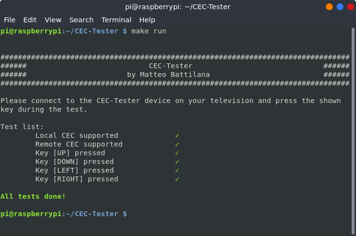

# CEC-Tester

CEC-Tester is an open source tester for the CEC protocol, built in C++.
This program is based on the [cec_simplest](https://github.com/DrGeoff/cec_simplest) example.



## Setup
### Libraries dependencies
In order to compile the CEC-Tester, you must install `libcec-dev` and `cec-utils`.
The `Makefile` contains a rule in order to install these libraries for Ubuntu.

```
  make ubuntu-install
```

## Basic usage

Plase follow the program istructions after the first run.
You can use the Makefile in order to compile and run the tester.

```
  make run
```

## License details

```
Copyright 2020 Matteo Battilana

Licensed under the Apache License, Version 2.0 (the "License");
you may not use this file except in compliance with the License.
You may obtain a copy of the License at

	http://www.apache.org/licenses/LICENSE-2.0

Unless required by applicable law or agreed to in writing, software
distributed under the License is distributed on an "AS IS" BASIS,
WITHOUT WARRANTIES OR CONDITIONS OF ANY KIND, either express or implied.
See the License for the specific language governing permissions and
limitations under the License.
```

> The library is Free Software, you can use it, extended with no requirement to open source your changes. You can also make paid apps using it.
